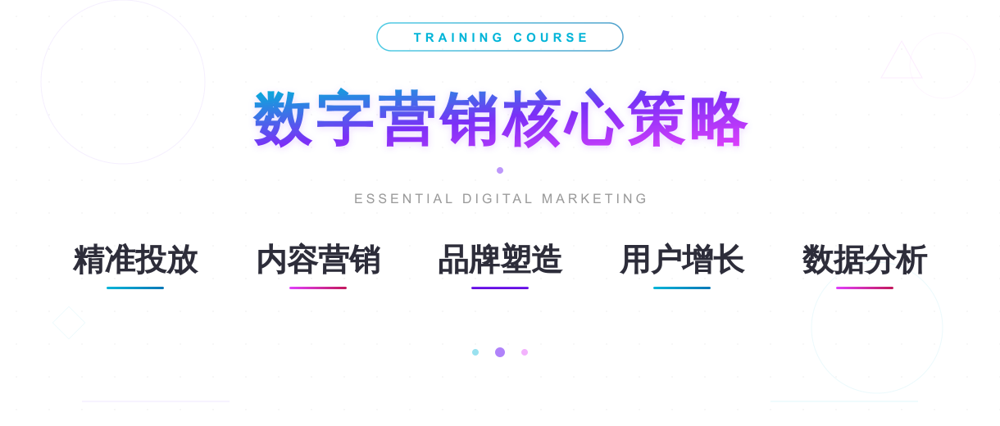

# 项目资源站

基于微信云开发的资源分享平台小程序，提供各类网创项目、工具、源码、教程等资源的展示与下载服务。

## 功能特性

### 用户端
- **首页** - 热门推荐、最新上架、免费专区，快速发现优质资源
- **分类浏览** - 支持多级分类筛选（网创、工具、源码、教程、直播、短视频、资料等）
- **搜索功能** - 关键词搜索，快速定位所需资源
- **资源详情** - 资源详细介绍、下载入口
- **VIP会员** - 多档会员套餐（月度/年度/终身/代理），享受专属权益
- **卡密激活** - 支持激活码开通会员
- **个人中心** - 会员状态查看、积分系统、个人信息管理

### 管理后台
- **卡密管理** - 批量生成卡密、查看卡密列表、状态管理
- **用户管理** - 用户列表、用户统计、会员状态管理
- **资源管理** - 资源的增删改查、批量导入、数据统计
- **数据统计** - 平台运营数据概览

## 技术栈

- **前端**: 微信小程序原生开发 (WXML/WXSS/JS)
- **后端**: 微信云开发
  - 云函数: 8个核心业务模块
  - 云数据库: 资源、用户、卡密等数据存储
- **基础库版本**: 2.25.4

## 项目结构

```
project-resource/
├── pages/                  # 页面目录
│   ├── index/             # 首页
│   ├── category/          # 分类页
│   ├── category-detail/   # 分类详情
│   ├── detail/            # 资源详情
│   ├── search/            # 搜索页
│   ├── vip/               # VIP会员页
│   ├── mine/              # 个人中心
│   └── admin/             # 管理后台
├── cloudfunctions/        # 云函数目录
│   ├── login/             # 登录获取openid
│   ├── resourceManager/   # 资源管理（CRUD）
│   ├── cardManager/       # 卡密管理
│   ├── userManager/       # 用户管理
│   ├── activateCard/      # 卡密激活
│   ├── checkVipStatus/    # VIP状态检查
│   ├── generateCards/     # 批量生成卡密
│   └── updateUserStats/   # 更新用户统计
├── tools/                 # 辅助工具
│   ├── auto-generator.html    # 自动生成工具
│   ├── card-generator.html    # 卡密生成器
│   └── resource-importer.html # 资源导入工具
├── images/                # 图片资源
├── app.js                 # 应用入口
├── app.json               # 应用配置
└── app.wxss               # 全局样式
```

## 云函数说明

| 云函数 | 功能描述 |
|--------|----------|
| login | 用户登录，获取 openid |
| resourceManager | 资源的增删改查、列表查询、统计 |
| cardManager | 卡密的查询与管理 |
| userManager | 用户信息管理与查询 |
| activateCard | 激活卡密，开通会员 |
| checkVipStatus | 检查用户VIP状态与有效期 |
| generateCards | 批量生成激活卡密 |
| updateUserStats | 更新用户统计数据 |

## 会员套餐

| 套餐 | 价格 | 时长 | 主要权益 |
|------|------|------|----------|
| 月度会员 | ¥39.9 | 30天 | 全部资源下载、VIP标识 |
| 年度会员 | ¥199 | 365天 | 全部权益 + 500积分 + 专属客服 |
| 终身会员 | ¥399 | 永久 | 全部权益 + 2000积分 + 资源定制 |
| 代理会员 | ¥999 | 永久 | 终身权益 + 50%分佣 + 代理后台 |

## 资源分类

- **网创项目** - 创业项目、副业兼职
- **实用工具** - 效率工具、自动化脚本
- **源码资源** - 各类开源/商业源码
- **学习教程** - 视频课程、电子书
- **AI工具** - AI相关应用与教程
- **短视频** - 短视频制作与运营
- **电商运营** - 电商相关资源
- **引流推广** - 流量获取与变现

## 快速开始

### 环境要求
- 微信开发者工具 (建议最新版)
- 微信小程序账号
- 已开通云开发服务

### 安装步骤
1. 使用微信开发者工具导入本项目
2. 在 `app.js` 中配置云开发环境ID
3. 上传并部署所有云函数
4. 初始化数据库集合（resources, users, cards 等）
5. 编译运行即可

### 配置说明
```javascript
// app.js 中修改为你的云环境ID
wx.cloud.init({
  env: "your-env-id",  // 替换为你的环境ID
  traceUser: true
})
```

## 开发说明

### 数据库集合
- `resources` - 资源信息表
- `users` - 用户信息表  
- `cards` - 卡密信息表
- `categories` - 分类信息表

### 权限控制
- 管理后台通过 `ADMIN_USER_ID` 控制访问权限
- 部分操作需要VIP权限验证
- 云函数内部进行数据权限校验

## 截示预览



## 注意事项

- 本项目仅供学习交流使用
- 请遵守微信小程序平台规范
- 商用前请确保已获得相应授权

## License

MIT License
